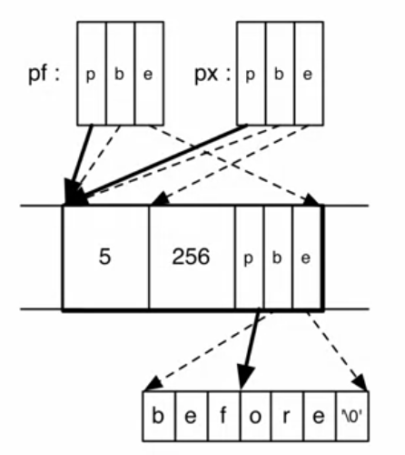

# Software Security

## Topic 2: Defenses against Low-Level Attacks

### 1. Memory Safety
- Only *create* pointers through standard means

#### Spatial Safety
- Pointer should only access memory that *belongs to* that pointer
- View pointers as triples (**p**, *b*, *e*)
	- **p** is the actual pointer
	- *b* is the base of the memory region it may access
	- *e* is the extent (bounds) of that region
- A buffer overflow violates spatial safety

```c
int x;			// assume sizeof(int)=4	
int *y = &x;	// p = &x, b = &x, e = &x+4
int *z = y+1;	// p = &x+4, b = &x, e = &x+4
*y = 3;			// OK: &x <= &x <= (&x+4)-4
*z = 3;			// BAD: &x+4 > (&x+4)-4
```

```c
struct foo {
	int x;
	int y;
	char *pc;
};
struct foo *pf = malloc();
pf->x = 5;
pf->y = 256;
pf->pc = "before";
pf->pc += 3;
int *px = &pf->x;
```
- Visualized Memory Layout  


```c
void copy(char* src, char *dst, int len) {
	int i;
	for (i = 0; i < len; i++) *dst++ = *src++;
}
```
#### Temporal Safety
- A **temporal safety violation** occurs when trying to *access undefined memory*
	- Spatial safety assures it was in a legal region
	- temporal safety assures that region is still in play
		- Undefined memory regions: *unallocated*, *unintialized* or *deallocated*

```c
// freed pointer
int *p = malloc(sizeof(int));
*p = 5;
free(p);
printf("%d\n", *p);	// violation
// unitialized pointer
int *p;
*p = 5;				// violation

// integer overflow
int f() {
	unsigned short x = 65535;
	x++;					// 0
	printf("%d\n",x);		// memory safe
	char *p = malloc(x);	// size 0 buffer!
	p[1] = 'a';				// violation
}

```

- The easiest way to avoid low-leval attacks is using memory-safe languages

### 2. Type Safety
- Each object is ascribed a **type**, and operations on the objects are always compatible with the type
	- Type safety is **stronger** than memory safety
- Dynamically Typed Languages
	- e.g. Ruby, Python
	- Can be viewed as *type safe*, because each object has one type **dynamic**
		- Any operation on dynamic object is permitted, but may be unimplemented (then throws an exception)
- Enforce Invariants
	- e.g. Java with Information Flow (JIF)

### 3. Avoiding Exploitation
1. Avoiding Stack Smashing Attack
- Changing the librairies, compiler or OS

- Detect overflows with **canaries**
	- Prevent putting code into the memory by buffer overflow
	- Use a stack canary, i.e. store some value in the stack, and check if the canary changes. If so, abort the program.
	- Choosing the canary value
		- Terminator canaries, random canaries, random XOR canaries
- Make stack & heap **non-executable**
	- Prevent getting `%eip` to attacker code
	- This can be bypassed by *return-to-libc*
		- Defense *return-to-libc*: User Address-Space Layout Randomization
			- Randomly place libraries in memory, making them harder to guess

### 4. Return-Oriented Programming (ROP)
- Blackhat hacker may use return-oriented programming even if we utilize ASLR and avoid using libc code

- ROP
	- *String together pieces of existing code*, called **gadgets**, to run your shellcode, rather than use libc function.
	- Challenges
		- Find the desired code pieces
		- How to string them together
	- Approach
		- Gadgets are instruction groups ending with `ret`
		- Stack serves as the code
	- Find the Gadgets
		- Automate a search of the binary for gadgets (tools like rp++)
	- Gadgets are Turing complete!

- Final conclusion: use memory-safe language!

### 5. Control Flow Integrity
- The previous methods only complicate the attack steps

- Bahavior-Based Detection
	- Observe the program's behavior - is it doing what we expect it to do?
		- Define expected behavior
			- **Control Flow Graph** (CFG)
		- Detect deviations efficiently
			- In-line Reference Monitor (IRM)
		- Avoid compromise of the detector
			- Sufficient randomness and immutability

- Tool: Modular CFI: good performance

- Example: CFG of the below program
	- sort2 -> sort -> lt & gt -> sort -> sort2 -> sort -> lt & gt ->  sort -> sort2

```c
void sort2(int a[], int b[], int len) {
	sort(a, len, lt);
	sort(b, len, gt);
}

bool lt(int x, int y) {
	return x<y;
}

bool gt(int x, int y) {
	return x>y;
}
```
- CFI: Compliance with CFG
	- Computer the call/return CFG
	- Monitor the control flow
		- Observation: direct calls needn't be monitored because they are immutable
		- Monitor only indirect calls, e.g. `jmp`, `call`, `ret` via registers
		- In the above code, `sort(a, len, lt)` is a direct call, while the control flow from `sort` to `lt` is via indirect call

- In-line Reference Monitor
	- Simplest Labeling
	- Detailed Labeling

- Defeat CFI?
	- Inject code with a legal label -> NO, because non-executable data
	- Modify code labels -> NO, because immutable program
	- Modify stack during a check -> NO, because registers cannot be changed
	- But CFI *cannot* assure
		- **Mimicry attacks**: manipulation of control flow that is allowed by the labels
		- Data leaks or corruptions

### 6. Secure Coding
- Coding Standard, Code Review and Testing
- Principle and Rule

#### Rule 1: Enforce Input Compliance
- Two examples

```c
int main() {
	char buf[100], *p;
	int i, len;
	while (1) {
		p = fgets(buf, sizeof(buf), stdin);
		if (p == NULL) return 0;
		len = atoi(p);

		p = fgets(buf, sizeof(buf), stdin);
		if (p == NULL) return 0;

		len = MIN(len, strlen(buf));	// this line of code fixs the flaw

		// vulnerable to integer overflow!
		for (i = 0; i < len; i++) {
			if (!iscntrl(buf[i])) putchar(buf[i]);
			else putchar('.');
		}
		printf("\n");
	}
}
```

```c
char digit_to_char(int i) {
	char convert[] = "0123456789";

	if (i < 0 || i > 0) return '?';	// this code fucks the cracker

	return convert[i]				// i could be negative or greater than 9!
} 
```
- General Principle: Robust Coding
	- *Minimizing Trust*
	- Pessimistically checks its assumed perconditions

### Rule 2: Use Safe String Functions
- For example

```c
char str[4];
strcpy(str, "hello");				// overflow!
strlcpy(str, "hello", sizeof(str))	// fails
```

### Rule 3: Don't Forget NUL Terminator
- C/C++ strings require one additional character to store a NUL terminator

```c
char str[3];
strcpy(str, "bye")		// write overflow!
int x = strlen(str);	// read overflow!
```

### Rule 4: Understand Pointer Arithmetic
### Rule 5: Use NULL after Freed

```c
int x = 5;
int *p = malloc(sizeof(int));
free(p);
p = NULL;		// defend against bad deref
int **q = malloc(sizeof(int*));
*q = &x;
*p = 5;			// crash (good)
**q = 4;
```

### Other Rules...
